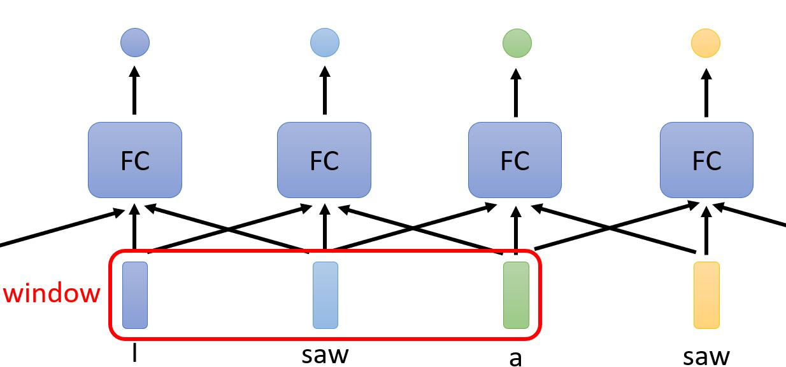
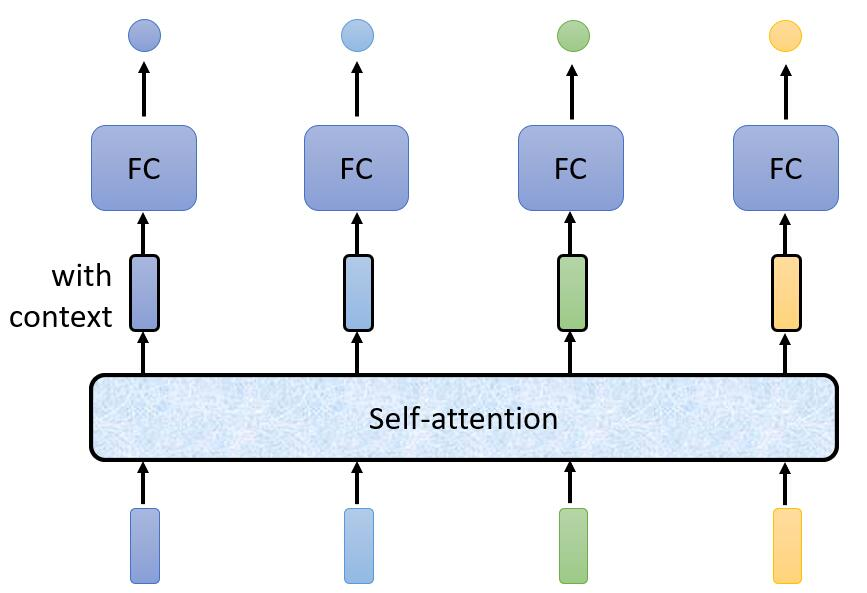

```
Authoer:lgx
Date:2022.08.22 22:30:42
Email:geniuslgx@mail.ustc.edu.cn
```

Self-attention

# 0. Source

>[video1](https://www.youtube.com/watch?v=hYdO9CscNes)
>
>[video2](https://www.youtube.com/watch?v=gmsMY5kc-zw&feature=youtu.be)

# 1. What

## 1.1 inpput

>一般的网络架构，接受的输入是**定长**的，Self-attention则是用于处理**变长输入**的网络架构。
>
>例：输入是一个句子，句子的长度是变化的，通过**One-hot**编码或者[**Word Embedding**](./Word Embedding.md)等方式将句子转化成**长度可变**的**向量组（Vector Set)**，

## 1.2 output

> - **输出与输入等长**
>
>   >又称**Sequence Labeling**
>   >
>   >场景1：给出一个英文句子，预测句子中每个单词的词性。
>   >
>   >场景2：[hw02](https://speech.ee.ntu.edu.tw/~hylee/ml/ml2022-course-data/hw2_slides%202022.pdf)
>
> - **只有一个输出**
>
>   >场景1：对网络上的评价，判断评价的情感类别。
>   >
>   >场景2：给出一段音频，判断是谁讲的。
>
> - **输出长度由机器自己决定**
>
>   >**seq2seq**
>   >
>   >场景1：翻译
>   >
>   >场景2：[hw05](https://speech.ee.ntu.edu.tw/~hylee/ml/ml2022-course-data/HW05.pdf)

## 1.3 Consider  Whole Context

>问题：**对I saw a saw 进行词性标注**
>
>
>
>若将每个单词分别输入到FC中，对于同样的单词**saw**，FC的输出**一定相同**，但第一个saw的词性为v，第二个saw的词性为n。
>
>可以将**单词前后相邻的单词（1个window）**作为输入，输入到FC中，这样一定程度上考虑到**上下文信息**。
>
>但是，若要考虑**整个句子**的上下文信息，且句子**很长**，则window的大小需要开得很大，这使得FC的**参数量多，且容易过拟合**。
>
>可以将词向量组通过一个Self-attention，得到**包含整个上下文信息**的词向量组。
>
>且可以**叠加多个**Self-attention。
>
>

# 2. How

