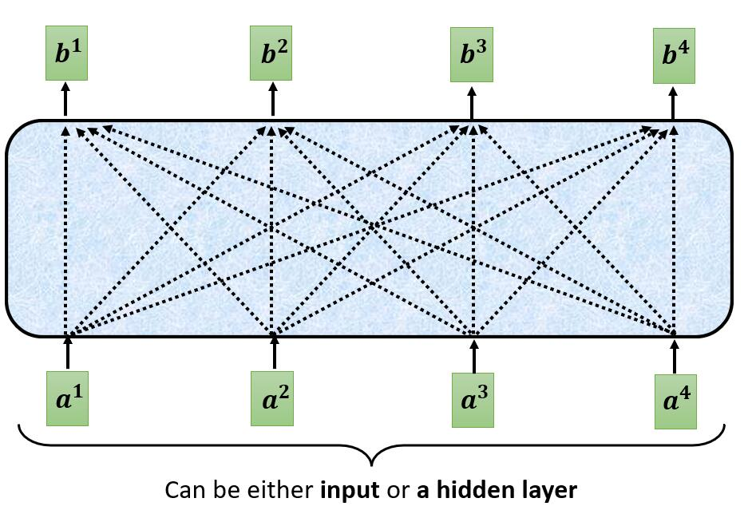
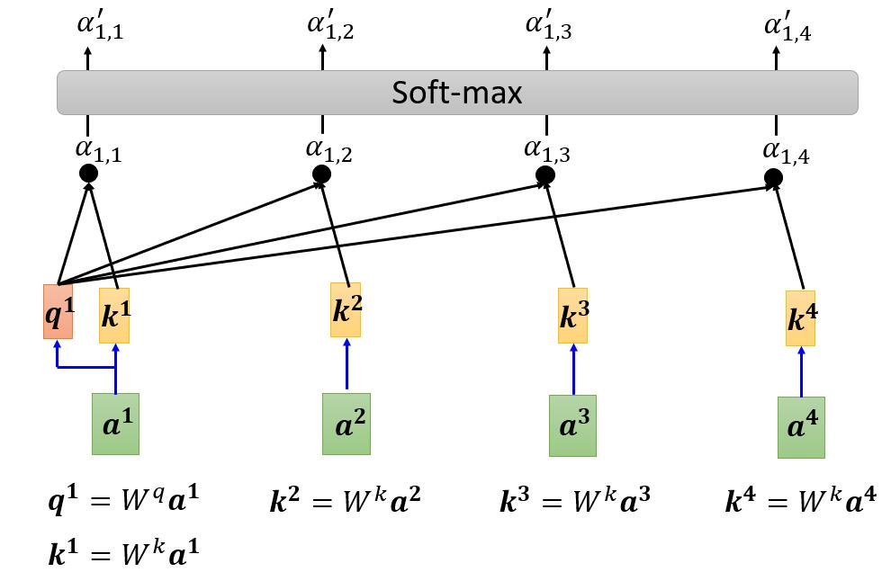
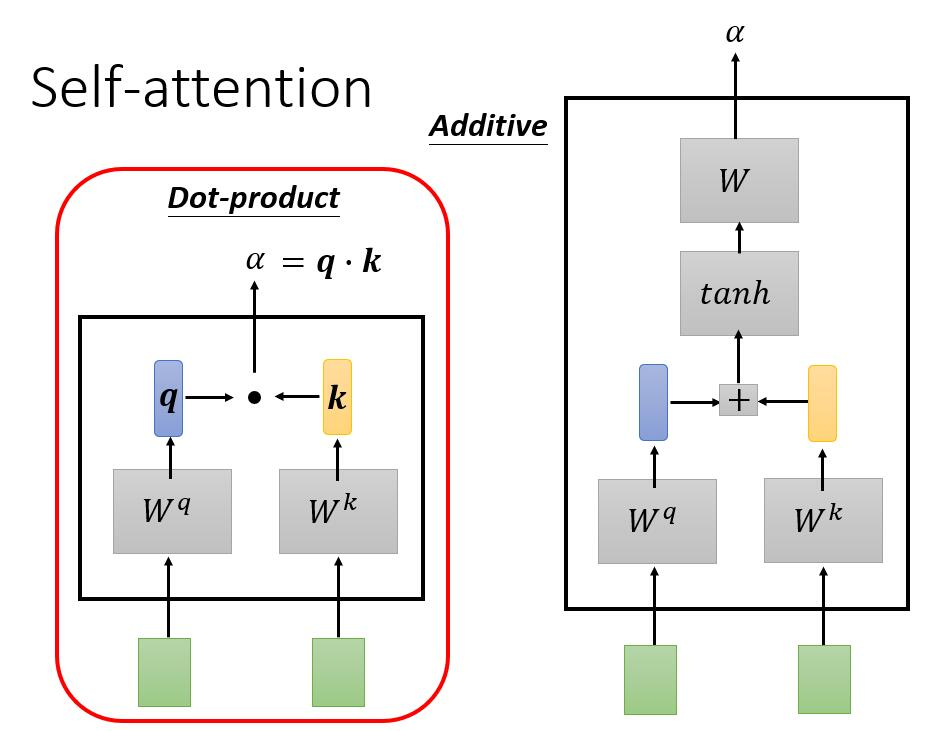
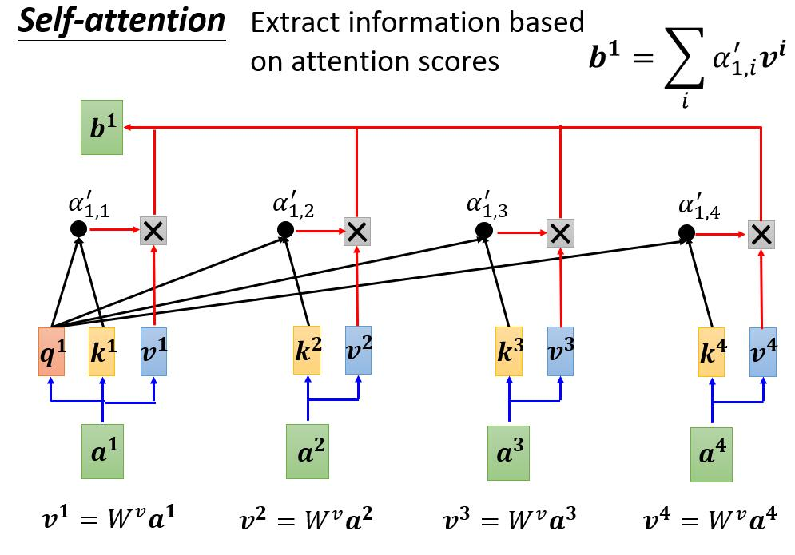

```
Authoer:lgx
Date:2022.08.22 22:30:42
Email:geniuslgx@mail.ustc.edu.cn
```

Self-attention

# 0. Source

>[video1](https://www.youtube.com/watch?v=hYdO9CscNes)
>
>[video2](https://www.youtube.com/watch?v=gmsMY5kc-zw&feature=youtu.be)

# 1. What

## 1.1 inpput

>一般的网络架构，接受的输入是**定长**的，Self-attention则是用于处理**变长输入**的网络架构。
>
>例：输入是一个句子，句子的长度是变化的，通过**One-hot**编码或者[**Word Embedding**](./Word Embedding.md)等方式将句子转化成**长度可变**的**向量组（Vector Set)**，

## 1.2 output

> - **输出与输入等长**
>
>   >又称**Sequence Labeling**
>   >
>   >场景1：给出一个英文句子，预测句子中每个单词的词性。
>   >
>   >场景2：[hw02](https://speech.ee.ntu.edu.tw/~hylee/ml/ml2022-course-data/hw2_slides%202022.pdf)
>
> - **只有一个输出**
>
>   >场景1：对网络上的评价，判断评价的情感类别。
>   >
>   >场景2：给出一段音频，判断是谁讲的。
>
> - **输出长度由机器自己决定**
>
>   >**seq2seq**
>   >
>   >场景1：翻译
>   >
>   >场景2：[hw05](https://speech.ee.ntu.edu.tw/~hylee/ml/ml2022-course-data/HW05.pdf)

## 1.3 Consider  Whole Context

>问题：**对I saw a saw 进行词性标注**
>
>
>
>若将每个单词分别输入到FC中，对于同样的单词**saw**，FC的输出**一定相同**，但第一个saw的词性为v，第二个saw的词性为n。
>
>可以将**单词前后相邻的单词（1个window）**作为输入，输入到FC中，这样一定程度上考虑到**上下文信息**。
>
>但是，若要考虑**整个句子**的上下文信息，且句子**很长**，则window的大小需要开得很大，这使得FC的**参数量多，且容易过拟合**。
>
>可以将词向量组通过一个Self-attention，得到**包含整个上下文信息**的词向量组。
>
>且可以**叠加多个**Self-attention。
>
>

# 2. How

>以Sequence Labeling为例，即输入个数等于输出个数。
>
>
>
>self-attention的输入可以是**初始输入x**或者**某个隐藏层的输出**，记为
>
>​										$A_{m\times n}=(a^1\ \ a^2\ ...\ a^n)$，其中$a^i={\begin{pmatrix} a^i_1 \\a^i_2\\...\\a^i_m\end{pmatrix}}_{m\times 1}$n为输入向量的个数，m为输入向量的维度。
>
>产生的输出记为
>
>​										$B_{p\times n}=(b^1\ \ b^2\ ...\ b^n)$，其中$b^i={\begin{pmatrix} b^i_1 \\b^i_2\\...\\b^i_p\end{pmatrix}}_{p\times 1}$p为输出向量的维度，p可以等于m，也可以不等。
>
>
>
>以$a^1$为例，计算其与其他向量的相关性系数$\alpha^{'}_{12},\alpha^{'}_{13}, ...\alpha^{'}_{1n}$，通常还要**计算自身与自身的相关性**，即$\alpha^{'}_{11}$
>
>需要1个Query矩阵和1个Key矩阵，记为：
>
>​										$W^q={\begin{pmatrix}q_{11}&q_{12}&...&q_{1m}\\q_{21}&q_{21}&...&q_{2m}\\...&...&...&...\\q_{s1}&q_{s2}&...&q_{sm}\end{pmatrix}}_{s\times m}$        $W^k={\begin{pmatrix}k_{11}&k_{12}&...&k_{1m}\\k_{21}&k_{21}&...&k_{2m}\\...&...&...&...\\k_{s1}&k_{s2}&...&k_{sm}\end{pmatrix}}_{s\times m}$
>
>Query矩阵和Key矩阵的**行维度s一定要相同要相同**。通过上图公式计算$q^1$和$k^1,k^2,...,k^n$,通过公式$\alpha_{1i}=q^1\dotproduct k^i$，计算**未归一化**的相关性系数$\alpha_{11},\alpha_{12},...\alpha_{1n}$，其中$\dotproduct$为**点乘**，$i=1,2,..,n$。再经过**softmax层**得到**归一化**的相关性系数$\alpha^{'}_{12},\alpha^{'}_{13}, ...\alpha^{'}_{1n}$。
>
>
>
>计算相关性系数不局限于上述方法，如上右图：可以将$k$向量与$q$向量相加后通过tanh，再进行一个transform(乘上某个矩阵)。
>
>
>
>接下来需要一个Value矩阵，记为：
>
> 										$W^v={\begin{pmatrix}v_{11}&v_{12}&...&v_{1m}\\v_{21}&v_{21}&...&v_{2m}\\...&...&...&...\\v_{p1}&v_{p2}&...&v_{pm}\end{pmatrix}}_{p\times m}$，用于对输入$a^i$进行转化，从而得到$v^i$，如上图公式。
>
>其**行向量维度p**决定最终的输出矩阵$B$的行维度，最终的输出
>
>​																		$b^i= \sum_{j=0}^{n}\alpha^{'}_{ij}\ \ v^j\\$
>
>以上过程都可以通过矩阵乘法，**实现并行**：
>
>提示：$W^q$与$W^k$为$s\times m$型，$W^v$为$p\times m$型，$A$为输入，$B$为输出，实际场景中m与n已知，s与p可以根据任务而设定。
>
>$Q_{s\times n}=W^q A_{m\times n}=(q^1\ q^2\ ...\ q^n)$，其中$q^i={\begin{pmatrix} q^i_1 \\q^i_2\\...\\q^i_s\end{pmatrix}}_{s\times 1}$，$K_{s\times n}=W^k A_{m\times n}=(k^1\ k^2\ ...\ k^n)$，其中$k^i={\begin{pmatrix} k^i_1 \\k^i_2\\...\\k^i_s\end{pmatrix}}_{s\times 1}$
>
>相关性系数矩阵$C_{n\times n}=Q^TK=\begin{pmatrix}\alpha^{'}_{11}&\alpha^{'}_{12}&...&\alpha^{'}_{1n}\\\alpha^{'}_{21}&\alpha^{'}_{21}&...&\alpha^{'}_{2n}\\...&...&...&...\\\alpha^{'}_{n1}&\alpha^{'}_{n2}&...&\alpha^{'}_{nn}\end{pmatrix}$，或被称为Attention矩阵
>
>
>
>$V_{p\times n}=W^v A_{m\times n}=(v^1\ v^2\ ...\ v^n)$，其中$v^i={\begin{pmatrix} v^i_1 \\v^i_2\\...\\v^i_p\end{pmatrix}}_{p\times 1}$
>
>$B_{p\times n}=VC=(b^1\ \ b^2\ ...\ b^n)$，其中$b^i={\begin{pmatrix} b^i_1 \\b^i_2\\...\\b^i_p\end{pmatrix}}_{p\times 1}$

